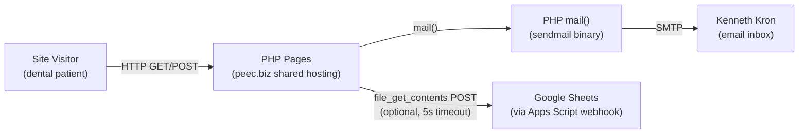

# System Overview

## System Context



**Evidence:** OBSERVED — `submit.php` lines 73-95 (mail + Sheets webhook),
`includes/mail.php` lines 8-18 (mail wrapper), `apps-script.gs` (Sheet append).

## Deployable Units

| Unit | Type | Files | Deploy Target |
|------|------|-------|---------------|
| Web application | PHP web app | `*.php`, `includes/`, `assets/`, `.htaccess` | peec.biz `public_html/neurowellnessdojo.com/` |
| Apps Script | Google Apps Script webhook | `apps-script.gs` (deployed separately) | Google Sheets |

**Evidence:** OBSERVED — `sync.sh` line 7 (`REMOTE_PATH="public_html/${SITE_NAME}/"`),
`apps-script.gs` lines 1-11 (deployment instructions in comments).

## Trust Boundaries

| Boundary | Control | Evidence |
|----------|---------|----------|
| Public → form handler | CSRF token (session-bound, `hash_equals`) | `submit.php:18` |
| Public → form handler | Honeypot field (silent success on trigger) | `submit.php:24-27` |
| Public → form handler | Rate limit (1 submission / 60s / session) | `submit.php:30-33` |
| Public → form handler | Email validation (`filter_var`) | `submit.php:48` |
| Public → config/includes | `.htaccess` deny rules (Apache-only) | `.htaccess:4-10` |
| Public → referral content | Session-based code gate ("DrClemans") | `index.php:21-28` |
| Form handler → Google Sheets | HTTP POST with 5s timeout, `@` error suppression | `submit.php:86-95` |

## Data Flows

### 1. Page Visit (GET)
```
Visitor → index.php/contact.php/KC-dds-ref/index.php
  → require config.php
  → require includes/mail.php → nwd_notify_visit() (throttled email)
  → require includes/variant.php → nwd_variant() (cookie read/set)
  → include includes/head.php (session_start, CSRF gen, HTML head)
  → render page content (variant-specific terms)
  → include includes/footer.php
```

### 2. Form Submission (POST)
```
Visitor → submit.php
  → require config.php, includes/variant.php, includes/mail.php
  → session_start()
  → validate method (POST only, else 405)
  → validate CSRF (hash_equals, else 400)
  → check honeypot (if filled → silent redirect to thank-you)
  → check rate limit (if <60s since last → 429)
  → validate fields (name, email, message lengths + email format)
  → nwd_send_mail() → PHP mail() → intake_email
  → file_get_contents POST → Google Sheets webhook (optional, best-effort)
  → set last_submit timestamp
  → burn CSRF token
  → redirect to thank-you.php
```

### 3. A/B Variant Assignment
```
Visitor → any page with variant include
  → nwd_variant(config)
  → check $_COOKIE['nwd_variant'] for 'A' or 'B'
  → if valid cookie: return it
  → else: mt_rand(0,1) → 'A' or 'B', setcookie (1yr TTL, HttpOnly, SameSite=Lax)
  → nwd_terms(variant) → returns array of word swaps
  → page renders with variant-specific language
```

## External Integrations

| Integration | Direction | Protocol | Failure Behavior | Evidence |
|-------------|-----------|----------|------------------|----------|
| PHP `mail()` | Outbound | sendmail binary | `@` suppressed; `submit.php:73` | OBSERVED |
| Google Sheets | Outbound | HTTP POST (JSON) | `@` suppressed, 5s timeout; email is source of truth | `submit.php:76-95` |
| SSH (deploy) | Outbound | rsync over SSH | Script exits on error | `sync.sh` |

## State & Persistence

| State | Location | Lifetime | Evidence |
|-------|----------|----------|----------|
| CSRF token | `$_SESSION['csrf']` | Session (regenerated per session) | `head.php:10-12` |
| A/B variant | Cookie `nwd_variant` | 1 year (configurable TTL) | `variant.php:15-25` |
| Rate limit | `$_SESSION['last_submit']` | Session | `submit.php:30,98` |
| Visit notification | `$_SESSION['notified_<page>']` | Session | `mail.php:29-31` |
| Code gate unlock | `$_SESSION['clemans_unlocked']` | Session | `index.php:23,28` |
| Intake records | Email inbox + Google Sheet | Persistent (external) | `submit.php:62-95` |
